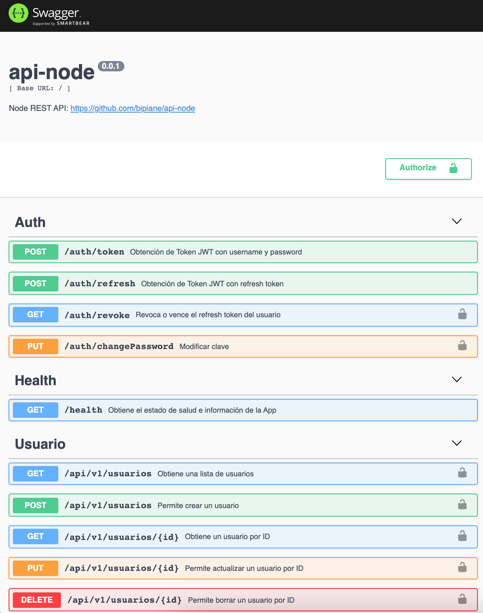

# Node REST API

[](https://www.tidyverse.org/lifecycle/#experimental)

https://api-node-ipianetti.herokuapp.com/doc

---

### Tools

- JWT
- Swagger OpenAPI Generator
- TypeScript
- MongoDB with TypeORM
- Docker
- BitBucket Pipelines with Heroku
- Code Style with Prettier
- Git Hooks with Husky
- Testing with Mocha

### Setup

Usar versión correcta de Node para el proyecto según `.nvmrc`

```
nvm use
```

```
npm install
```

Crear variables de entorno para conexión con MongoDB

```
# Environment
cp .env.dist .env
```

Ejecutar aplicación y sincronizar base de datos

```
npm run dev
# 🚀 Server started: http://localhost:3000/doc
```    
Swagger UI


Ejecutar migración para crear usuarios iniciales

```
npm run migration:run
```

## Development

Ejecutar luego de editar controladores y entidades.

Creará las rutas de api y su [swagger.json](./apiDoc/swagger.json),
según la configuración [tsoa.json](./tsoa.json)
```
npm run tsoa:gen
```

## Testing
```
npm run test
npm run coverage 
# Ver reporte coverage en:
open coverage/lcov-report/index.html
```

## Servidor local

```
# Crear Build
npm run build
# Migrar Base de Datos
npm run migration:run
# Correr aplicación
npm run prod
```

## Servidor local con Docker

```
# Crear Build
npm run build
# Migrar Base de Datos
npm run migration:run
# Crear y levantar contenedor
docker-compose --env-file .env -f docker/docker-compose.yml up -d --build
# 🚀 Server started: http://localhost:3000/doc
# Apagar contenedor
docker-compose --env-file .env -f docker/docker-compose.yml stop
```

## Deploy en Heroku con BitBucket Pipeline

Configurado según script `build`, `start` de `package.json`, `Procfile` y `bitbucket-pipelines.yml`.

```
# En cada push a master se dispara el pipeline y su deploy en Heroku
git push origin master
```

Luego de unos minutos la API quedará publicada en https://api-node-ipianetti.herokuapp.com/doc

## Configuración MongoDB
La aplicación usa 2 bases de datos, una de autenticación `DB_AUTH_SOURCE` y otra para la propia aplicación.

Se crea el usuario en la db de autenticación: 
```
# Ingresar a mongodb
mongo -u admin -p admin
# Ingresar a la db 'admin' y crear usuario
use admin;
db.createUser({
      user: "user_api",
      pwd: "1234",
      roles: [                
        {role: "dbAdmin",   db: "api_node"},
        {role: "readWrite", db: "api_node"}
     ]
  });
```
Ejecutar migraciones para crear base de datos y tablas:
```
npm run migration:run
```

## Contributing

Formater código con [Prettier](https://prettier.io/) según `.prettierrc` antes de hacer commit:

```
npm run prettier
```
